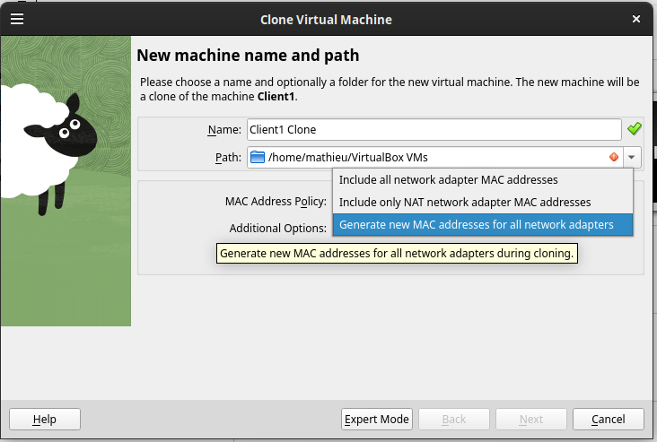
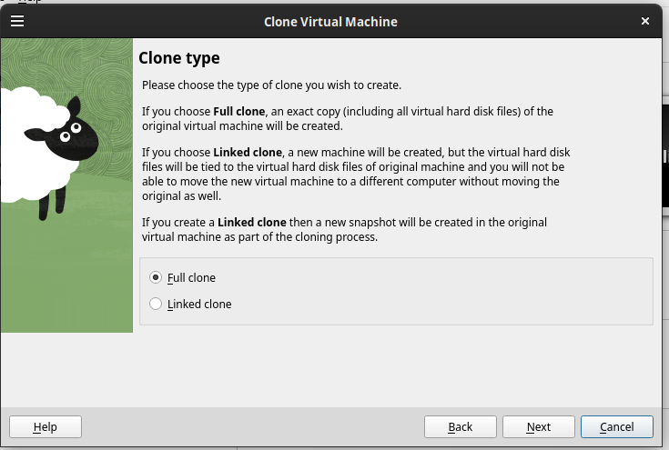
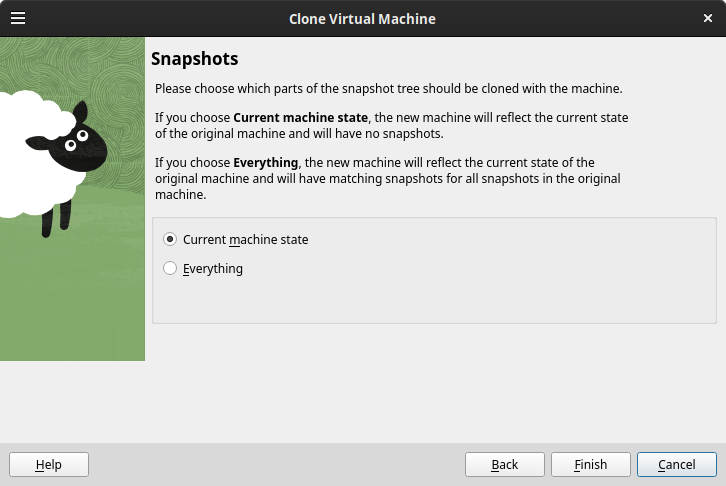
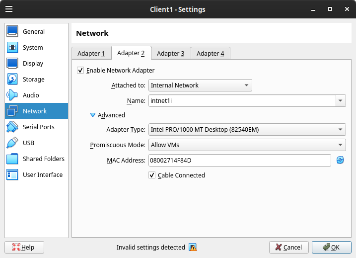

# Anleitung zur Instalation und Nutzung von OpenVPN
## Voraussetzungen
Für die Durchführung des Versuches werden min. 5 unterschiedliche Linux VM's benötigt. Diese sollten ein Ubuntu oder Kubuntu OS installiert haben.  
Es wird Virtualbox zum Ausführen der VM's verwendet. Eine Internet-Anbindung des ausführenden Rechners wird benötigt.
## Installation einer VM
Je nach eigenem Bedarf kann eine neu VM verwendet werden. Es wird empfohlen eine VM aufzusetzen und diese im Folgenden 4-mal zu klonen, um alle benötigten Rechner zu erhalten. Da eine Vielzahl von VM's benötigt wird, ist es empfehlenswert eine minimalistische Installation durchzuführen.  

**Die Sprache der zu verwendenden VMs ist zwingend auf Englisch zu stellen.**
## Ursprüngliches Setup
Nachdem die zu klonende VM ausgewählt wurde, sind folgenden Schritte zu beachten:
1. Proxyeinstellung vornehmen (/etc/environment)
2. Maschine Updaten
3. Folgende Pakete installieren: git, tcpdump, iperf3, vim (`sudo apt install git tcpdump iperf3 vim`)
4. Kopieren der Scripte. Es gibt zwei Ausführungen
    1. Skripte für eigene Rechner. Liegen im folgenden Directory: `git clone https://github.com/RandomCad/VPN` oder auf dem Transferlaufwerk unter dem Ordner *Personen-Skripte*
    1. Skripte für die Unirechner (pool) liegen auf gihub in der branche **University** `git switch University` oder auf dem Transferlaufwerk unter dem Ordner *Universitäts-Scripte*
6. Zum Umschalten in den CLI Modus folgenden Befehl ausführen: `sudo systemctl set-default multi-user.target`
## Cloning und VBox Einstellungen
Die Ursprükgliche VM ist nun in 4 VMs zu vervielfältigen. Die folgende Bennenung wird von uns verwendet:
* RouterM
* RouterL
* ClientL
* RouterR
* ClientR  
### VM's Clonen
Zuerst ist das Klonen für die gewollte Basismaschine auszuwählen. Hier auf öffnet sich ein neues Fenster. In
diesem ist der Name der neuen Maschine anzugeben, sowie die 'MAC Address Policy' auf 'Generat new MAC addresses for all network adapters' auszuwählen.  
  
Im nächsten Fenster ist *Full clone* auszuwählen.  
  
Die Einstellungen im letzten Fenster sind nicht weiter relevant.  
  
### Netzwerkkonfiguration
* RouterM
    * Adapter 1: Klassisches Nat Network
    * Adapter 2: Internes Netzwerk, Benennung bspw: '**intnetL**'
    * Adapter 3: Internes Netzwerk, Benennung bspw: '**intnetR**'
    * Adapter 4: Unverbunden
* RouterL
    * Adapter 1: Unverbunden
    * Adapter 2: Internes Netzwerk, Benennung bspw: '**intnetLi**'
    * Adapter 3: Internes Netzwerk, verbunden mit '**intnetL**'
       * Hierbei muss unter '**Erweitert**' der Promiscous-Modus auf '**erlauben für alle VMs**' gesetzt werden
    * Adapter 4: Unverbunden  
  
* RouterR
    * Adapter 1: Unverbunden
    * Adapter 2: Internes Netzwerk, Benennung bspw: '**intnetRi**'
    * Adapter 3: Internes Netzwerk, verbunden mit '**intnetR**'
       * Hierbei muss unter '**Erweitert**' der Promiscous-Mode auf '**erlauben für alle VMs**' gesetzt werden
    * Adapter 4: Unverbunden
* ClientL
    * Adapter 1: Unverbunden
    * Adapter 2: Internes Netzwerk, verbunden mit **intnetLi**
    * Adapter 3: Unverbunden
    * Adapter 4: Unverbunden
* ClientR
    * Adapter 1: Unverbunden
    * Adapter 2: Internes Netzwerk, verbunden mit **intnetRi**
    * Adapter 3: Unverbunden
    * Adapter 4: Unverbunden
### System - Leistungseinstellungen
Wir empfehlen die Leistung der VMs auf ein funktionsfähiges Minimum zu reduzieren.  
1 Core reicht vollkommen aus. Das Herabsetzen der Execution Capp ist auch möglich. Wir empfehlen folgende Einstellungen:
|Maschine|Core Number|Execution Capp|Speicher - Kubuntu|Speicher - Ubuntu|
|:------:|:---------:|:------------:|:----------------:|:---------------:|
|RouterM |1          |80%           |650 MB            |512 MB           |
|RouterL |1          |60%           |650 MB            |512 MB           |
|RouterR |1          |60%           |650 MB            |512 MB           |
|ClientL |1          |50%           |650 MB            |512 MB           |
|ClientR |1          |50%           |650 MB            |512 MB           |
# Ausführung der Skripte
Die Skripte sind mit oder ohne sudo auszuführen. Sie werden in jedem Falle eine sudo Berechtigung durchführen müssen. Ausnahme hiervon sind die beiden Skripte **vpn_r-L_client.sh** und **vpn_r-R_server.sh**, welche zwingend mit Sudo ausgeführt werden müssen. Es ist empfehlenswert die Skripte vom M-Router als erstes auszuführen. Es wird folgende Durchführung empfohlen:
## Netzwerkskripte:
* Router M
   * _network.sh
      * dieses sollte 2 Fehlermeldung generieren (da die beiden anderen Router noch nicht konfiguriert sind)
* Router L
   * _network.sh
      * dieses sollte 1 Fehlermeldung generieren (da der zugehörige Client noch nicht konfiguriert ist)
* Client L
   * _network.sh
* Router R
   * _network.sh
      * dieses sollte 1 Fehlermeldung generieren (da der zugehörige Client noch nicht konfiguriert ist)
* Client R
   * _network.sh

## VPN Skripte
* Router R
   * _server.sh
      * dieses sollte bei dem ersten Durchlauf mehrere Keyfiles und Zertifikate erzeugen
   * Kopieren der Zertifikate ca.crt, client.crt und der Schlüssel client.key, ta.key in einen geteilten Ordner des Hostsystems
* Router L
   * _client.sh
      * dieses sollte einen Fehler erzeugen, da die Keyfiles und Zertifikate fehlen
   * Kopieren der Zertifikate ca.crt, client.crt und der Schlüssel client.key, ta.key vom geteilten Ordner des Hostsystems nach /etc/openvpn/keys
   * _client.sh
   * _test.sh
      * läuft schief, weil VirtualBox die Bridge blockiert
   * RL_closeSession.sh
   * _client.sh --no-bridge
   * _test.sh
      * läuft immernoch schief, zeigt aber, das VPN Verbindung zustande kommt 

